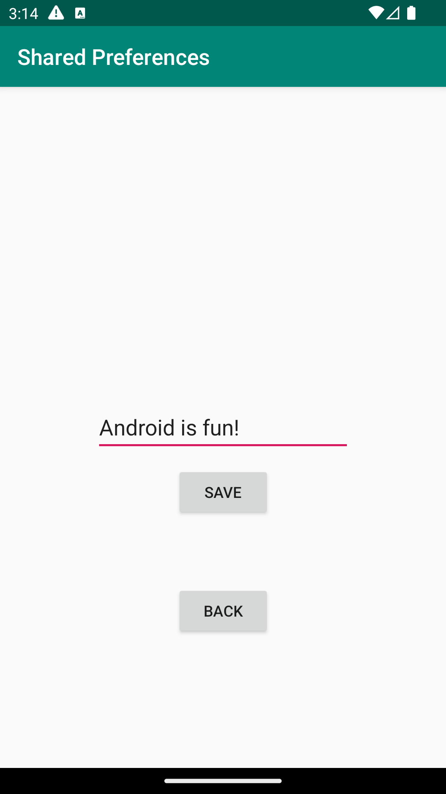
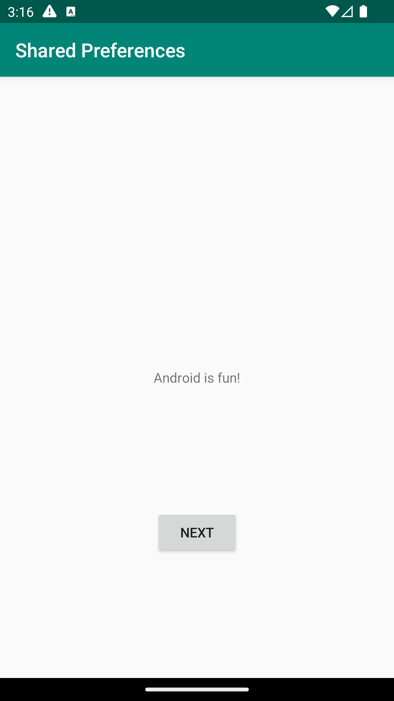

# Rapport
Det skapades en fil som döptes till SecondActivity.java och den kopplades ihop med layoyten activity_second.xml
där editText finns och en knapp för att spara det som önskas presentera i en textview i activity_main.xml.
För att kunna spara önskad text så behövs en onClick skapas på den knappen i activity_second där en metod
som heter savePref körs, som finns i SecondActivity. Som kodexemplet nedan visar så är den kopplad till
den editText som sedan skriver den texten till SharedPreferences.
```
    public void savePref(View v){
        SharedPreferences myPreferenceRef = getSharedPreferences("MyPreferenceName", MODE_PRIVATE);
        SharedPreferences.Editor myPreferenceEditor = myPreferenceRef.edit();
        // Get the text
        newPrefText=new EditText(this);
        newPrefText=(EditText)findViewById(R.id.editText);
        // Store the new preference
        myPreferenceEditor.putString("MyAppPreferenceString", newPrefText.getText().toString());
        myPreferenceEditor.apply();
        // Clear the EditText
        newPrefText.setText("");
    }
```
När SharedPreferences har fått sitt värde så läses den in i MainActivity i en onResume-metod för att inte
skriva över den vid start av applikaitonen. Däremot så presenteras den i onCreate-metoden för att visa den 
text som är sparad i den (se kodexempel nedan).
```
public class MainActivity extends AppCompatActivity {

    @Override
    protected void onCreate(Bundle savedInstanceState) {
...
        SharedPreferences myPreferenceRef = getSharedPreferences("MyPreferenceName", MODE_PRIVATE);
        SharedPreferences.Editor myPreferenceEditor = myPreferenceRef.edit();
        TextView prefTextRef=new TextView(this);
        prefTextRef=(TextView)findViewById(R.id.textView);
        prefTextRef.setText(myPreferenceRef.getString("MyAppPreferenceString", "Fel text"));
    ...
    @Override
    protected void onResume() {
        super.onResume();
        SharedPreferences myPreferenceRef = getSharedPreferences("MyPreferenceName", MODE_PRIVATE);
        SharedPreferences.Editor myPreferenceEditor = myPreferenceRef.edit();
        TextView prefTextRef=new TextView(this);
        prefTextRef=(TextView)findViewById(R.id.textView);
        prefTextRef.setText(myPreferenceRef.getString("MyAppPreferenceString", "Fel text"));
    }

}
```

Bilder läggs i samma mapp som markdown-filen.
Screenshot på SecondActivity:

Screenshot på MainActivity med sparat värde ifrån editText:



